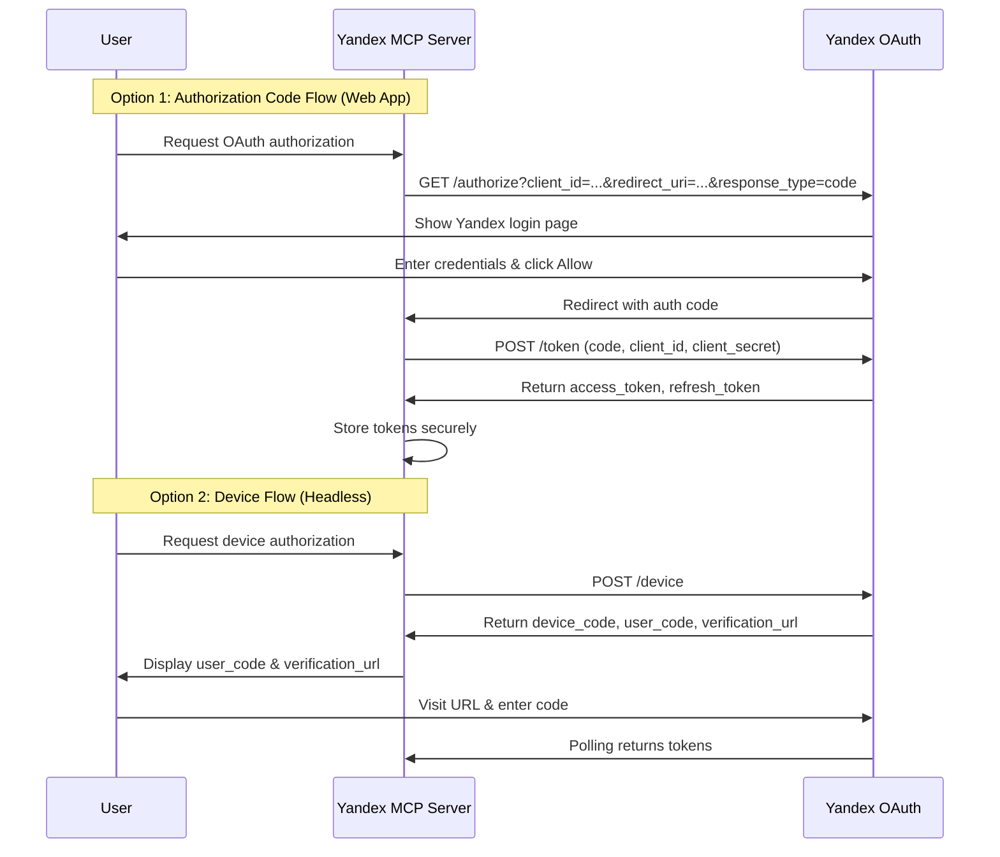

# OAuth Token Retrieval Implementation Plan

## Overview
Add OAuth token retrieval functionality to enable automatic token acquisition and refresh for Yandex Direct and Metrika APIs.

## Current State
- **Config** (`yandex_mcp/config.py`): Contains API endpoints and timeouts
- **Client** (`yandex_mcp/client.py`): Uses static Bearer/OAuth tokens from environment variables
- **Environment**: `YANDEX_TOKEN`, `YANDEX_DIRECT_TOKEN`, `YANDEX_METRIKA_TOKEN`

## Architecture

### New Files
```
yandex_mcp/
├── oauth.py              # NEW: OAuth client and token management
├── token_storage.py      # NEW: Secure token storage (file-based)
└── ...
```

### OAuth Flow Diagram



## Implementation Steps

### Step 1: Research OAuth Endpoints
- **Authorization URL**: `https://oauth.yandex.ru/authorize`
- **Token URL**: `https://oauth.yandex.ru/token`
- **Device URL**: `https://oauth.yandex.ru/device`
- **Required scopes**: `direct:api`, `metrika:read`, `metrika:write`

### Step 2: Add OAuth Configuration (config.py)
```python
# OAuth settings
YANDEX_OAUTH_URL = "https://oauth.yandex.ru"
YANDEX_OAUTH_AUTHORIZE_URL = "https://oauth.yandex.ru/authorize"
YANDEX_OAUTH_TOKEN_URL = "https://oauth.yandex.ru/token"
YANDEX_OAUTH_DEVICE_URL = "https://oauth.yandex.ru/device"

# Token storage path
TOKEN_STORAGE_PATH = "~/.yandex_mcp/tokens.json"
```

### Step 3: Implement OAuth Client (oauth.py)
- `OAuthClient` class with methods:
  - `get_authorization_url()` - Generate authorization URL
  - `exchange_code_for_token(code)` - Exchange auth code for tokens
  - `get_device_code()` - Initiate device flow
  - `poll_for_token(device_code)` - Poll for device token
  - `refresh_token(refresh_token)` - Refresh expired token

### Step 4: Implement Token Storage (token_storage.py)
- Secure file-based storage with encryption
- Methods: `save_token()`, `load_token()`, `clear_token()`

### Step 5: Integrate with YandexAPIClient
- Modify `__init__` to support OAuth token retrieval
- Add fallback: static token → OAuth flow → error

### Step 6: Add MCP Tools
- `oauth_start_authorization` - Start web OAuth flow
- `oauth_get_device_code` - Get device code for headless
- `oauth_check_status` - Check token status
- `oauth_revoke` - Revoke tokens

## Environment Variables
| Variable | Required | Description |
|----------|----------|-------------|
| `YANDEX_CLIENT_ID` | Yes | OAuth application client ID |
| `YANDEX_CLIENT_SECRET` | Yes | OAuth application client secret |
| `YANDEX_OAUTH_REDIRECT_URI` | No | Callback URL (default: oob) |
| `YANDEX_TOKEN_SCOPE` | No | Comma-separated scopes |

## Acceptance Criteria
1. Users can authenticate via web authorization code flow
2. Users can authenticate via device flow (headless)
3. Tokens are automatically refreshed before expiration
4. Tokens are stored securely
5. MCP tools allow managing OAuth lifecycle
6. Backward compatible with static tokens
